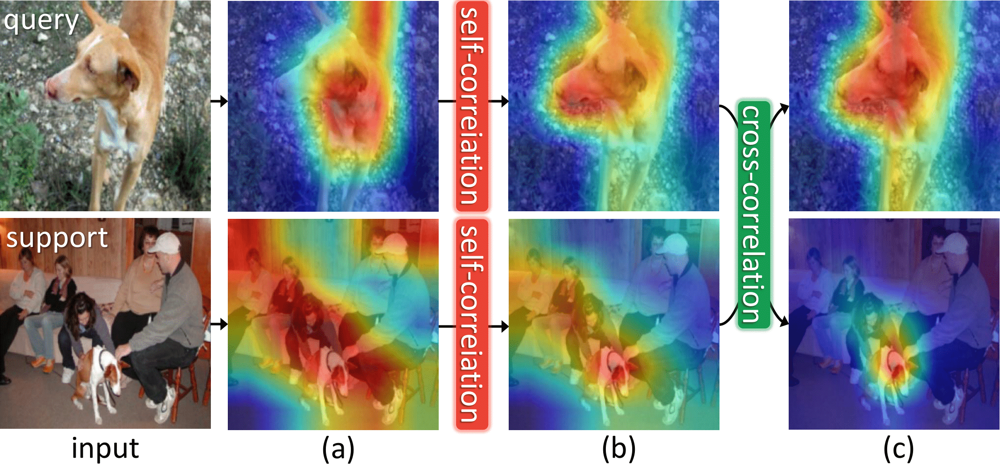

<div align="center">
  <h1>Relational Embedding for Few-Shot Classification (ICCV 2021)</h1>
</div>

<div align="center">
  <h3><a href=http://dahyun-kang.github.io>Dahyun Kang</a>, <a href=http://arunos728.github.io>Heeseung Kwon</a>, <a href=http://juhongm999.github.io>Juhong Min</a>, <a href=http://cvlab.postech.ac.kr/~mcho/>Minsu Cho</a></h3>
</div>

<div align="center">
  <h4> <a href=http://arxiv.org>:link:paper</a>, <a href=http://cvlab.postech.ac.kr/research/RENet>:link:project hompage</a></h4>
</div>


<div align="center">
  
</div>

<p align="justify">
  We propose to address the problem of few-shot classification by meta-learning “what to observe” and “where to attend” in a relational perspective. 
  Our method leverages relational patterns within and between images via self-correlational representation (SCR) and cross-correlational attention (CCA). 
  Within each image, the SCR module transforms a base feature map into a self-correlation tensor and learns to extract structural patterns from the tensor.
  Between the images, the CCA module computes cross-correlation between two image representations and learns to produce co-attention between them. 
  (a), (b), and (c) visualize the activation maps of base features, self-correlational representation, and cross-correlational attention, respectively.
  Our <b>Relational Embedding Network (RENet)</b> combines the two relational modules to learn relational embedding in an end-to-end manner.
  In experimental evaluation, it achieves consistent improvements over state-of-the-art methods on four widely used few-shot classification benchmarks of miniImageNet, tieredImageNet, CUB-200-2011, and CIFAR-FS.
</p>

## :heavy_check_mark: Requirements
* Ubuntu 16.04
* Python 3.7
* [CUDA 11.0](https://developer.nvidia.com/cuda-toolkit)
* [PyTorch 1.7.1](https://pytorch.org)


## :gear: Conda environmnet installation
```bash
conda env create --name renet_iccv21 --file environment.yml
conda activate renet_iccv21
```

## :books: Datasets
```bash
cd datasets
bash download_miniimagenet.sh
bash download_cub.sh
bash download_cifar_fs.sh
bash download_tieredimagenet.sh
```

## :deciduous_tree: Authors' checkpoints (_will be available soon_)

```bash
bash scripts/download_renet_checkpoints.sh
```
The file structure should be as following:


    
    renet/
    ├── datasets/
    ├── model/
    ├── scripts/
    ├── checkpoints/
    │   ├── cifar_fs/
    │   ├── cub/
    │   ├── miniimagenet/
    │   └── tieredimagenet/
    train.py
    test.py
    README.md
    environment.yml
    
    
    
   
## :pushpin: Quick start: testing scripts
To test the downloaded model on _DATASET_ in an 5-way _K_-shot setting:
    
    bash scripts/test/DATASET_5wKs.sh
For example, to test the 5-way 1-shot model on miniImagenet:

    bash scripts/test/miniimagenet_5w1s.sh


## :fire: Training scripts
To train a model on _DATASET_ in an 5-way _K_-shot setting:
    
    bash scripts/train/DATASET_5wKs.sh
For example, to train the 5-way 1-shot model on CUB:

    bash scripts/train/cub_5w1s.sh

Training & testing a 5-way 1-shot model on the CUB dataset using a TitanRTX 3090 GPU takes **41m 30s**.

## :art: Few-shot classification results
Experimental results on few-shot classification datasets with ResNet-12 backbone. We report average results with 2,000 randomly sampled episodes.

<table>
  <tr>
    <td>datasets</td>
    <td colspan="2" align="center">miniImageNet</td>
    <td colspan="2" align="center">tieredImageNet</td>
  </tr>
  <tr>
    <td>setups</td>
    <td>5-way 1-shot</td>
    <td>5-way 5-shot</td>
    <td>5-way 1-shot</td>
    <td>5-way 5-shot</td>
  </tr>
  <tr>
    <td>accuracy</td>
    <td align="center">67.60</td>
    <td align="center">82.58</td>
    <td align="center">71.61</td>
    <td align="center">85.28</td>
  </tr>
</table>

<table>
  <tr>
    <td>datasets</td>
    <td colspan="2" align="center">CUB-200-2011</td>
    <td colspan="2" align="center">CIFAR-FS</td>
  </tr>
  <tr>
    <td>setups</td>
    <td>5-way 1-shot</td>
    <td>5-way 5-shot</td>
    <td>5-way 1-shot</td>
    <td>5-way 5-shot</td>
  </tr>
  <tr>
    <td>accuracy</td>
    <td align="center">79.49</td>
    <td align="center">91.11</td>
    <td align="center">74.51</td>
    <td align="center">86.60</td>
  </tr>
</table>


## :mag: Related repos
Our project references the codes in the following repos:

* Zhang _et al_., [DeepEMD](https://github.com/icoz69/DeepEMD).
* Ye _et al_., [FEAT](https://github.com/Sha-Lab/FEAT)
* Wang _et al_., [Non-local neural networks](https://github.com/AlexHex7/Non-local_pytorch)
* Ramachandran _et al_., [Stand-alone self-attention](https://github.com/leaderj1001/Stand-Alone-Self-Attention)
* Huang _et al_., [DCCNet](https://github.com/ShuaiyiHuang/DCCNet)
* Yang _et al_., [VCN](https://github.com/gengshan-y/VCN)

## :pray: Acknowledgement
We appreciate the authors of [DeepEMD](https://github.com/icoz69/DeepEMD) where we adopt the major code bases.
We also sincerely thank all the ICCV reviewers, especially R#2, for suggestions and valuable pointers :love_letter:. 


## :scroll: Citing RENet
If you find our code or paper useful to your research work, please consider citing our work using the following bibtex:
```
@inproceedings{kang2021renet,
    author   = {Kang, Dahyun and Kwon, Heeseung and Min, Juhong and Cho, Minsu},
    title    = {Relational Embedding for Few-Shot Classification},
    booktitle= {Proceedings of the IEEE/CVF International Conference on Computer Vision (ICCV)},
    year     = {2021}
}
```
